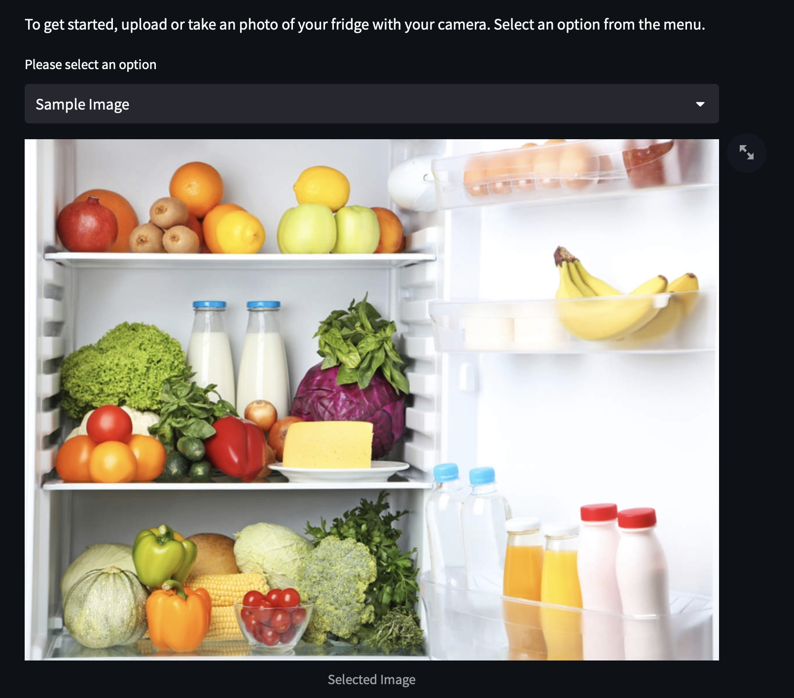
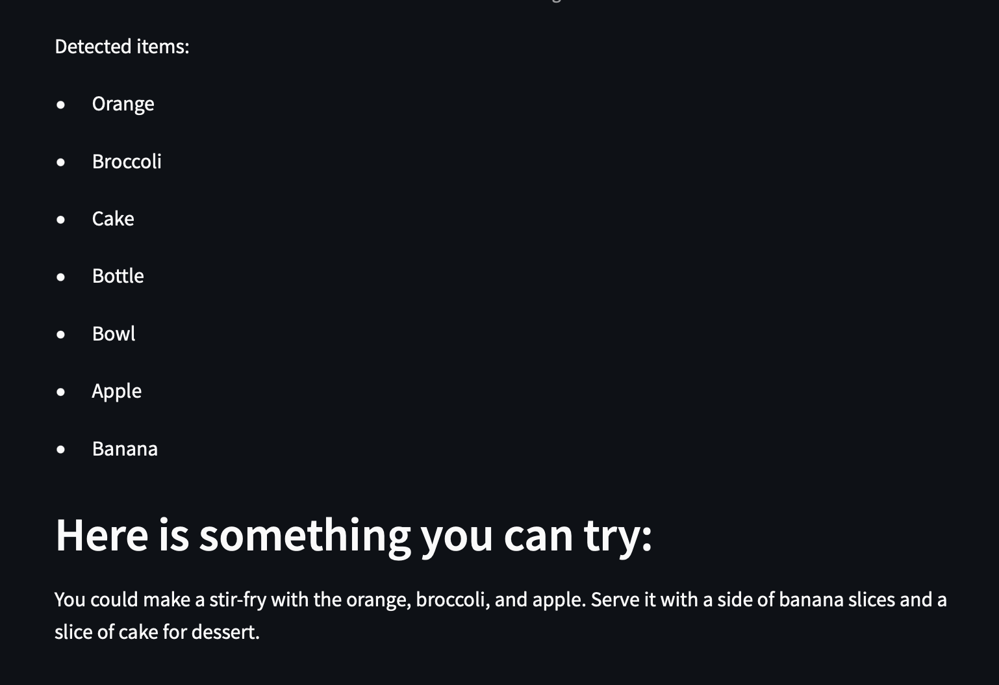
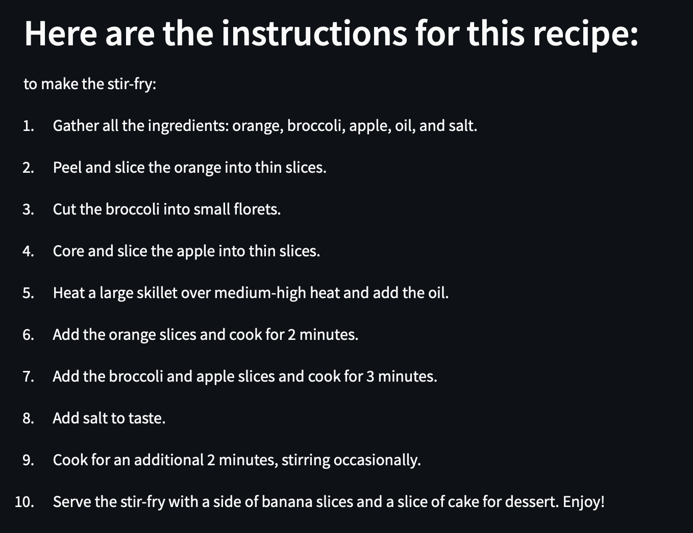

# What's in your Fridge

This is a simple app that uses the OpenAI API to generate recipes based on the ingredients you have in your fridge. To identify the ingredients, I have used the pretrained DETR model from the HuggingFace library. The app has been created using Streamlit.

This app is still a work in progress. I am planning to add more features to it in the future.

The DETR model is trained on the COCO dataset. This dataset only contains the following instances of food items:
1. Apple
2. Banana
3. Orange
4. Broccoli
5. Carrot
6. Hot dog
7. Pizza
8. Donut
9. Cake
10. Sandwich 

As a result of this, the model is currently limited in its ability to identify food items. I am planning to fine tune this model on the Food-101 dataset in the future.

# Demo

1. Fire up streamlit app with `streamlit run main.py`
2. Here is a demo of the app using a sample image I took from google images:

3. The DETR model identifies the ingredients in the image:

4. The app then uses OpenAI's GPT3 API to generate the name of a recipe based on the ingredients. Finally GPT3 is called again to generate the steps for the suggested recipe.

# Installation steps
1. Install all the necessary packages with pip: 
`pip install -r requirements.txt`
2. You need to have your OPENAI_API_KEY environment variable set like: 
`export OPENAI_API_KEY=[your key]`
3. Run your script with the following command:
`streamlit run main.py`
4. This should open up a new tab in your browser with the app running.